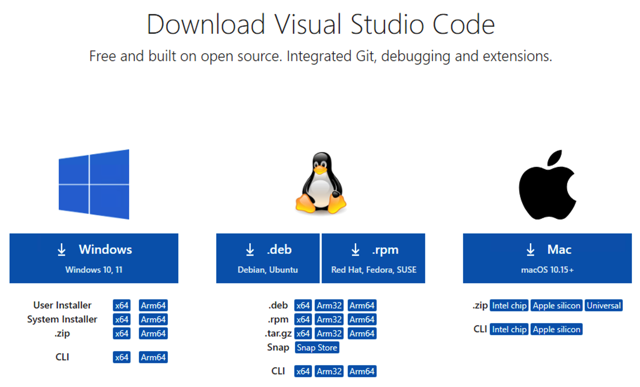
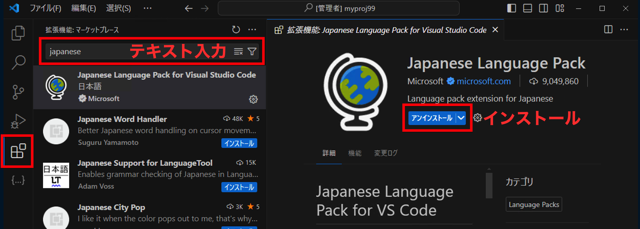
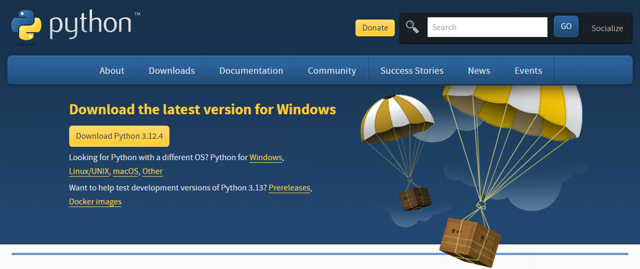
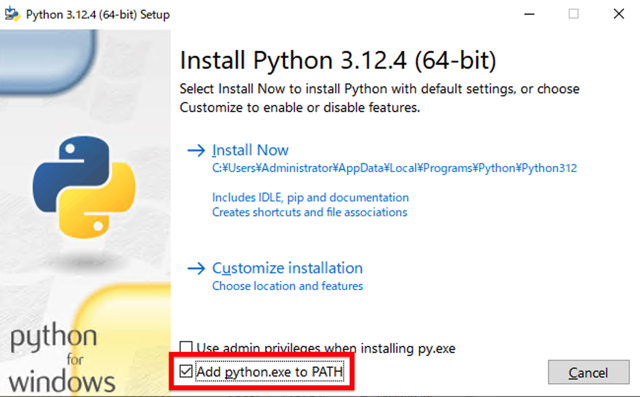
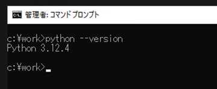

# 準備編

- Windows PCをお使いの方が多いと思いますので、Windowsの場合のみ記載します
- Macでもほぼ同様の手順で進められます

## 1. VS Codeインストール

1. [Visual Studio Code のダウンロードページ](https://code.visualstudio.com/download) からインストーラをダウンロードします
  

2. インストーラを起動し、インストールを行います

3. 最低限必要な拡張機能をインストールします
  
   - Japanese Language Pack
   - Python
   - Pylance など
   - あとは必要になった時に徐々に入れていけば良いと思います
   - 【参考記事】[Visual Studio Codeに入れるべき拡張機能【2023年最新版】 - Qiita](https://qiita.us5.list-manage.com/track/click?u=e220ac811523723b60d055c87&id=e6660f5f97&e=afe4815717)


## 2. Pythonインストール
1. [Python公式ページ](https://www.python.org/downloads/) からインストーラをダウンロードします
  

2. インストーラを起動します

3. 下図のように「`Add python.exe to PATH`」のオプションにチェックを入れ、「Install Now」をクリックします
  
  【重要】上記オプションをチェックをしないでインストールした場合、後でリカバリーもできますが面倒な設定が必要になります

4. 設定を有効にするために、PCを再起動します

5. コマンドプロンプトを起動し、下記のコマンドを実行します（コマンドプロンプトは、Windowsのスタートメニューで「cmd」と検索すると表示されます）

```
python --version
```

下図のように、Pythonのバージョンが表示されたら完了です。



<br>以上で事前準備は終了です。お疲れ様でした。

<br>2024@rockyhg (Hiroki Haga)
