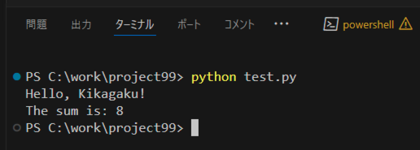

# VS Codeのセットアップ
Visual Studio Code の最低限の使い方をマスターしましょう。

## 1. VS Codeの基本設定
### 拡張機能【再掲】
   - Japanese Language Pack
   - Python
   - Pylance など
   - あとは必要になった時に徐々に入れていけば良いと思います
   - 【参考記事】[Visual Studio Codeに入れるべき拡張機能【2023年最新版】 - Qiita](https://qiita.us5.list-manage.com/track/click?u=e220ac811523723b60d055c87&id=e6660f5f97&e=afe4815717)

### 配色
1. `Ctrl + Shift + P` でコマンドパレットを表示します
   - このコマンドパレットは、色々なことに使用するので、このショートカットは覚えておくと便利です。
2. `color theme` と入力し、「基本設定:配色テーマ」をクリック
3. 好みの配色テーマを選択


## 2. 基本的なPythonプロジェクトの作成

1. 新しいフォルダを作成する
   - 例: `C:\work\myProject99`
2. VS Code で上記フォルダを開く
   - フォルダをドラッグ＆ドロップ
   - または [ファイル] > [フォルダーを開く...]
3. 新規Pythonファイル (`test.py`) を作成する
   - [新しいファイル] ボタン
   - または [ファイル] > [新しいファイル...]

```python
# test.py
print("Hello, World!")
```

4. test.py を実行する
   - ターミナルを開く
     - [表示] > [ターミナル]
     - または `Ctrl + J`
   - ターミナルに `python test.py [Enter]` と入力

5. ターミナルに `Hello, World!` と表示される



## 3. ショートカットキー
[VS Code チートシート（ショートカットキー）](https://camo.qiitausercontent.com/8e7b0b88be526969f856b75f97e05b23516f0d72/68747470733a2f2f71696974612d696d6167652d73746f72652e73332e616d617a6f6e6177732e636f6d2f302f38313534382f30353238666333382d376132312d353665622d313331612d3562636663643866363965312e706e67)

主なものを抜粋:
- `Ctrl + Shift + P`: でコマンドパレットを表示
- `Alt + ↑ / ↓`: 行の上下移動
- `Shift + Alt + ↑ / ↓`: 現在の行をコピーして上下にペースト
- `Ctrl + Shift + K`: 現在の行を削除
- `Ctrl + Enter`: 現在の行の下に新しい行を挿入

<br>2024@rockyhg (Hiroki Haga)
