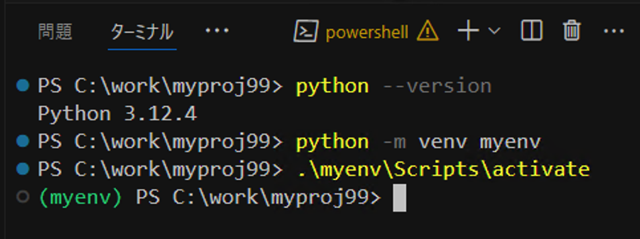
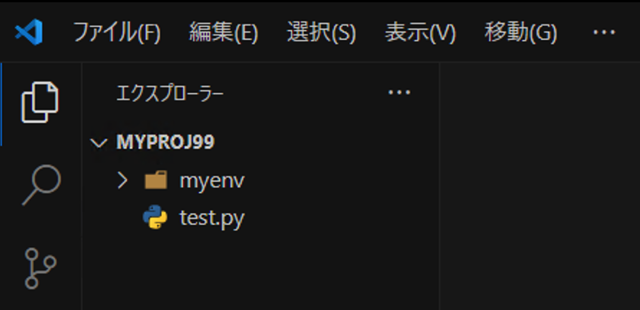
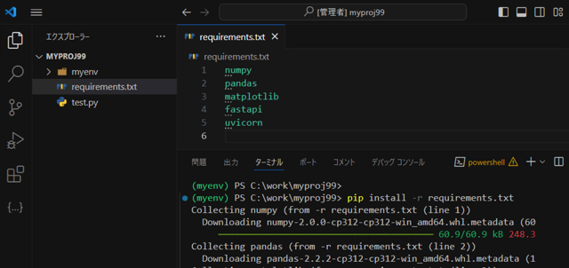

# 環境管理ツール (venv) の導入

## 1. 仮想環境とは？

仮想環境は、Pythonのプロジェクトごとに独立した環境を作るためのものです。これにより、プロジェクトごとに異なるバージョンのライブラリをインストールしても他のプロジェクトに影響を与えることなく作業できます。

例えば、あるプロジェクトで使っているライブラリのバージョンを変更するときに、別のプロジェクトに影響を与えないようにするために仮想環境を使います。

1. **依存関係の管理:** プロジェクトごとに必要なライブラリやそのバージョンが異なることが多いです。仮想環境を使うことで、プロジェクトごとにこれらの依存関係を管理できます。
2. **システム環境の汚染防止:** システム全体のPython環境にライブラリをインストールすると、他のプロジェクトやシステム自体に影響を与える可能性があります。仮想環境を使うことでこれを防ぎます。
3. **再現性の確保:** 仮想環境を使うことで、他の開発者が同じ環境で作業することができ、開発環境の再現性を高めることができます。


## 2. 仮想環境の作成
- VS Codeのターミナルを起動
   - [表示] > [ターミナル]
   - or `Ctrl + J`
- 仮想環境を作成する（以下のコマンドを実行）
   - `python -m venv <仮想環境名(自分で名付ける)>`
   - （「ワークスペースに設定しますか」というメッセージが出たら [はい] を押す）
   - 仮想環境名のフォルダ（隠しフォルダ）が作成され、Python実行環境が格納されている

```shell
# 例
python -m venv myenv
```

- 仮想環境をアクティベートする
   - Windowsの場合: `myenv\Scripts\Activate`
   - Macの場合: `source myenv/bin/activate`
   - コマンドラインに `(<仮想環境名>)` が表示される
     - 例: `(myenv)`

- 仮想環境を終了する `deactivate`






## 3. パッケージ・ライブラリ管理
### 3.1 pipを使用したパッケージのインストール
- 仮想環境をアクティベートする
   - Windows: `myenv\Scripts\activate`
   - Mac: `source .venv/bin/activate`

- pip コマンドを実行する
   - `pip install <パッケージ名>`
   - エラーが出る場合は、先頭に `python -m ` を付加して実行
     - `python -m pip install <パッケージ名>`

```shell
# pip 自体をアップデート
python -m pip install --upgrade pip

# numpy をインストール
pip install numpy
```

### 3.2 requirements.txtの作成と使用:
- `requirements.txt` ファイルの役割
  - プロジェクトが正しく動作するために必要な外部のパッケージやライブラリ（これらを依存関係と呼ぶ）の明確化
  - リストに記載された全ての依存関係を一括でインストールできる
  - 再現性の保証
  - デプロイの効率化

- 仮想環境をアクティベートする【実施済み】
- `requirements.txt` を新規作成し、必要なライブラリを記述する

```
# requirements.txt
numpy
pandas
matplotlib
fastapi
uvicorn
```

- pip コマンドを実行する
  - `pip install -r requirements.txt`



<br>◀ [1. VS Codeのセットアップ](./1_vscode.md) | [3. FastAPI動作確認](./3_fastapi.md) ▶

2024@rockyhg (Hiroki Haga)
