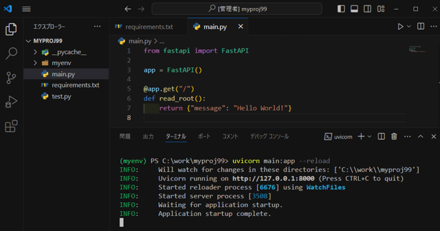
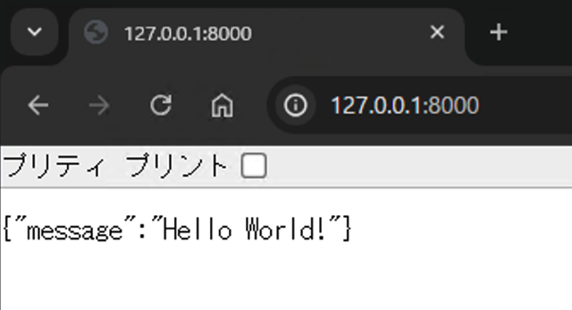

# FastAPI動作確認

1. 仮想環境をアクティベートする【実施済み】

2. `uvicorn` と `fastapi` をインストールする【実施済み】
   - requirements.txt に記述 or
   - `pip install uvicorn fastapi` を実行

3. `main.py` を作成

```python
from fastapi import FastAPI

app = FastAPI()


@app.get("/")
def read_root():
    return {"message": "Hello World!"}
```

4. ローカルサーバーを起動する（ターミナルで以下のコマンドを実行）
   - `uvicorn main:app --reload`
   - うまくいかない場合、先頭に `python -m ` を付ける
     - `python -m uvicorn main:app --reload`

5. ブラウザで [http://127.0.0.1:8000/](http://127.0.0.1:8000/) にアクセスする
   - ブラウザに `{"message": "Hello World!"}` と表示される






<br>2024@rockyhg (Hiroki Haga)
